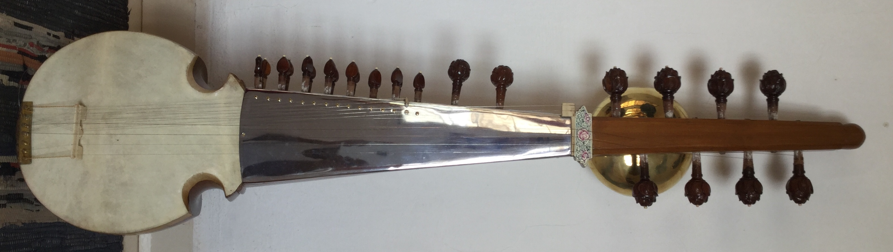

Having spent many years [learning Sarod](/about/#early-days-and-music-training), and then some more in a keen quest for the [elusive Sursringar](/blog/why-chandraveena/), I only thought it appropriate to write a post describing these two beautiful instruments. They are alike, and yet, worlds apart!

There are varied accounts on the evolution of the rabab, the sarod and the sursringar. Many researchers and commentators have written articles, journal papers and books on the subject. Setting aside the history of these instruments, I would like to talk about sarod and sursringar as they are played today, specifically from the perspective of their design and musical capability.

<notice-box>

### Sarod

 

*A Sarod from the author’s collection crafted by the late Mohan Lal Sharma.*
 

Sarod is a natural evolution from Rabab (for introduction to Rabab, read my post on [Sursringar](/blog/sursringar-blog/###Rabab). As you can see from the picture above, Sarod has a hollow wooden body (made of tun / red cedar or teak wood). The wooden resonator is covered with hide, and the finger board is a steel plate with chromium finish. There are variations in the shape, size and number of strings of different sarod styles, but typically, a Sarod has 4 main playing strings on which melody / raga is played, and a number of support strings. Sarod also has sympathetic strings, which are tuned to the notes of the raga being played. This gives an addtional dimension to the instrument. The appropriate sympathetic strings resonate as the notes are played on the main playing strings, adding to resonance and contributing to the harmonics. Sarod is plucked with a coconut shell plectrum, and the main playing strings are pressed by finger nail against the metal finger board, giving clarity and sustain.

[Read more](https://en.m.wikipedia.org/wiki/Sarod) on Sarod

</notice-box>

<notice-box>

### Sursringar

 

*A Sursringar from the author’s collection crafted by the late Mohan Lal Sharma.*
 

Sursringar, in evolution history, is a older instrument than present day Sarod. Sursringar evolved as a result of the limitations of Seni Rabab (read my post on [The Story of Sursringar](/blog/sursringar-blog). As you can see from the picture above, Sursringar has a rounded gourd (pumpkin) resonator, covered by wooden sound board. A hollow carved neck is attached to the resonator, and the finger board is made of steel with chromium finish. There are a few variations in the number of strings, and the tuning methodology, but typically, a Sursringar has 5 main melody strings and 3 additional support strings. The sursringar above has been customised to my requirement with an additonal melody string. Sursringar can be plucked with a coconut shell plectrum, or a wire plectrum. The melody strings are played by finger nails pressed against the metal finger board. 
The combination of gourd resonator, wooden sound board and metal finger board gives the instrument considerable resonance and sustain. This negates the need of sympathetic strings as seen in rabab and sarod.

[Read more](https://en.m.wikipedia.org/wiki/Sursingar) on Sursringar

</notice-box>

As you can see from these pictures, there are physical similarities between sarod and sursringar. However, being larger in size than a sarod and replacing its hide with a large soundboard, a sursringar has outstanding acoustics.

Traditionally, sursringar continued to be played in Dhrupad style, and with enough sustain, there was no need for *Taraf* or sympathetic strings that are seen in a sarod. By contrast, a sarod is equipped with taraf to compensate for lower resonance compared to a sursringar. It is also believed that the Taraf strings interfere with finer tones, and hence a sursringar, which is designed as a Dhrupad instrument, is best played without Taraf. Sursringar also has a flat *Jawaari* bridge compared to the point shaped bridge of Sarod. This unique Jawaari capability of a sursringar gives rise to its rich harmonics and sound, and the sustain allows the harmonics to emerge. Typically both instruments are played with either a *mizrab* - a wire plectrum, or a *jawaa* - a guitar style plectrum made of coconut shell.

*A Jawaa plectrum made from coconut shell.*

 

The plectrum on the right is wrapped with a cloth dipped in beeswax. With the player's body heat, this releases just enough wax for lubrication.

*A Mizrab or wire plectrum.*

 

A mizrab has traditionally been used for playing a Veena, Sitar or *Surbahar*. There is mention of a wire plectrum being used for playing sarod and sursringar too. But I am not sure of its shape or make, and whether it is the same as pictured above.

There are two basic solfas or syllables of plectrum use in a rabab, sarod or sursringar. The downward stroke is *Da*, and the upward stroke is *Ra*. Now, a combination of strokes can give rise to more syllables like *Dire*, *Dra*, etc, and a combination of syllables to form phrases like *Da Ra Dire Dire* and so on. These phrases are often used in very complex rhythmic patterns, especially in the composition section.

Sursringar by temperament is suited for a slow melodic exploration of Ragas (Alap). Although modern Sarod is capable of Alap, by temperament, it is well suited for fast playing, complex rhythmic patterns played on strings known as *Tarparan* (tar - string, paran - rhythmic patterns)

Considering some of the similarities between the instruments, and the fact that Sursringar evolved earlier than present day Sarod, it may be a conjecture to say the Sarod took inspiration from Sursringar. Or did it evolve independently? If you have any thoughts on the subject, do [leave me a note](/contact/#leave-a-message).
